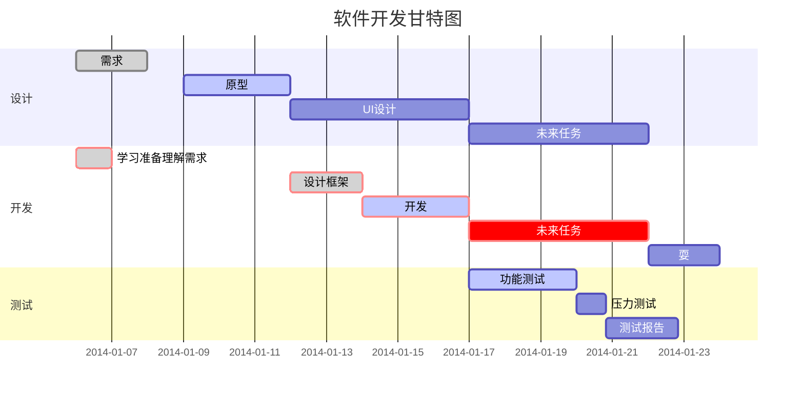

##  [官方文档](https://docs.spring.io/spring-framework/docs/current/reference/html/)
### 1 [概述（历史，设计哲学，反馈以及示例）](https://docs.spring.io/spring-framework/docs/current/reference/html/overview.html#overview-philosophy)
### 2 [核心模块（IoC，事件，资源，i18n，校验，数据绑定，类型转换，Spring表达式语言，AOP）](https://docs.spring.io/spring-framework/docs/current/reference/html/core.html#spring-core)
### 3 [测试模块（Mock对象，TestContext框架，Spring MVC测试，WebTestClient）](https://docs.spring.io/spring-framework/docs/current/reference/html/testing.html#testing)
### 4 [数据访问模块（事务，DAO支持，JDBC，R2DBC，O/R映射，XML编组）](https://docs.spring.io/spring-framework/docs/current/reference/html/data-access.html#spring-data-tier)
### 5 [Web Servlet模块（Spring MVC，WebSocket，SockJS，STOMP Messaging）](https://docs.spring.io/spring-framework/docs/current/reference/html/web.html#spring-web)
### 6 [Web Reactive模块（Spring WebFlux，WebClient，WebSocket）](https://docs.spring.io/spring-framework/docs/current/reference/html/web-reactive.html#spring-webflux)
### 7 [集成模块（远程调用，JMS，JCA，JMX，邮件，任务，调度，缓存）](https://docs.spring.io/spring-framework/docs/current/reference/html/integration.html#spring-integration)
### 8 [语言模块（Kotlin，Groovy，动态语言）](https://docs.spring.io/spring-framework/docs/current/reference/html/languages.html)

